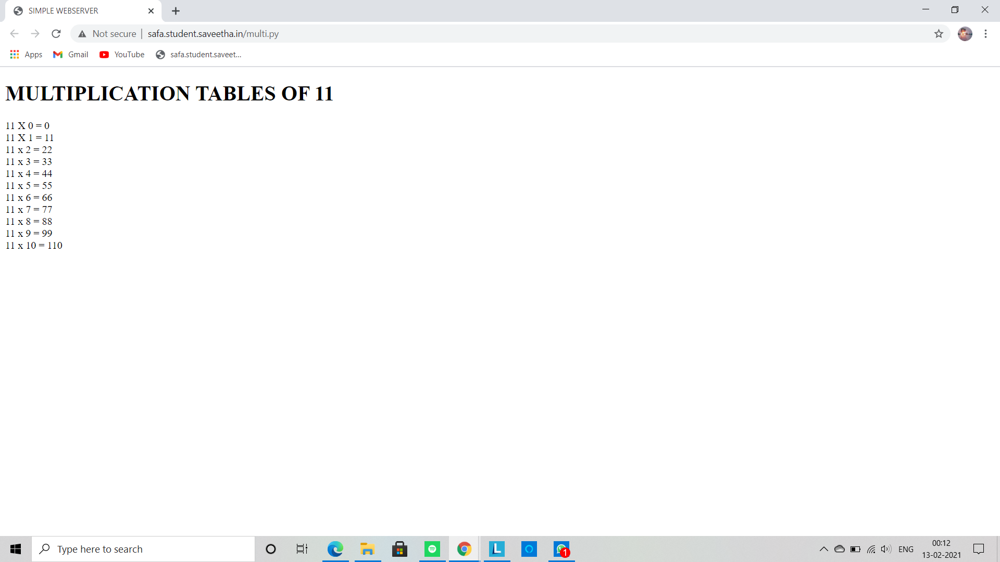

    # Developing a Simple Webserver
## AIM:
To develop a simple webserver to serve html pages.

## DESIGN STEPS:
### Step 1: 
HTML content creation
### Step 2:
Design of webserver workflow
### Step 3:
Implementation using Python code
### Step 4:
Serving the HTML pages.
### Step 5:
Testing the webserver

## PROGRAM:
```
from http.server import HTTPServer, BaseHTTPRequestHandler

content= """
<!DOCTYPE html>
<html>
<head>
<title>My webserver</title>
</head>
<body>
<h1> 11 TIMES TABLE</h1>
11 x 0 = 0 <br>
11 x 1 = 11 <br>
11 x 2 = 22 <br>
11 x 3 = 33 <br>
11 x 4 = 44 <br>
11 x 5 = 55 <br>
11 x 6 = 66 <br>
11 x 7 = 77 <br>
11 x 8 = 88 <br>
11 x 9 = 99 <br>
11 x 10 = 110 

</body>
</html>
"""

class MyHandler(BaseHTTPRequestHandler):
    def do_GET(self):
        print("hello world")

        #To create response header
        self.send_response(200)
        self.send_header('Content-type', 'text/html; charset=utf-8')
        self.end_headers()

        #To send the response
        self.wfile.write(content.encode())


# To create server address
server_address = ('',80)       

#To create server object
httpd = HTTPServer(server_address,MyHandler)


#To listen at the specified port
print("My webserver is running...")
httpd.serve_forever()
```
## OUTPUT:


## RESULT:
Thus a website is designed for the simple webserver and is hosted in the 
URL: http://safa.student.saveetha.in/multi.py. HTML code is validated.


